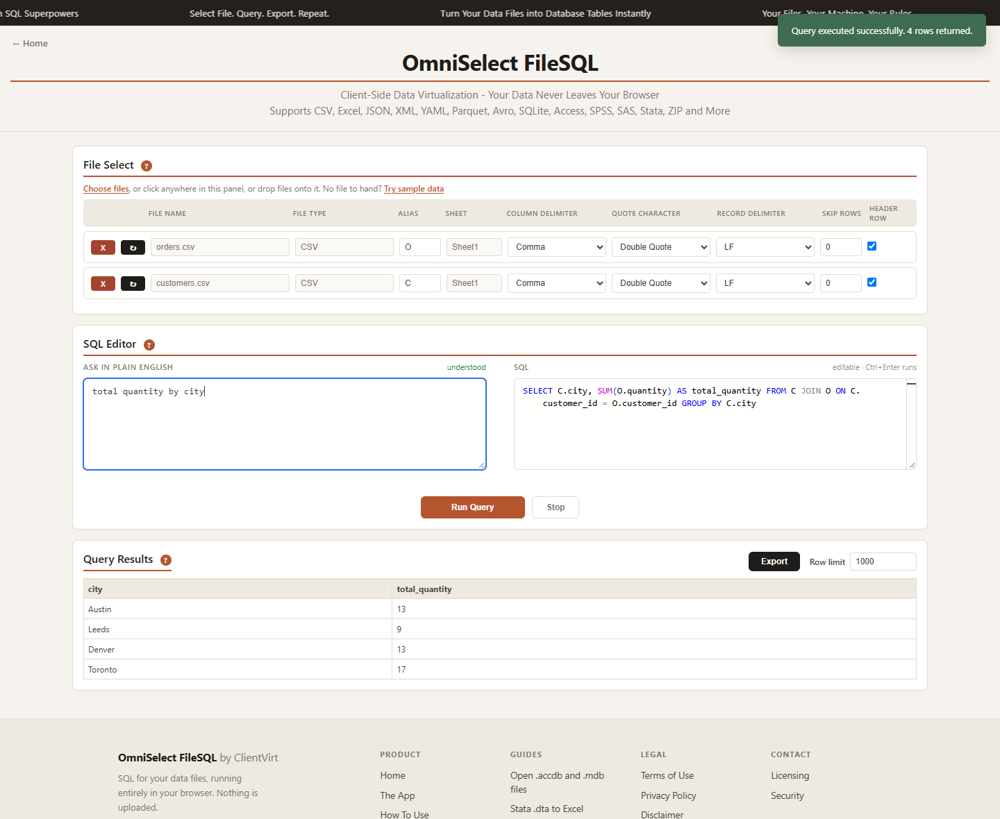
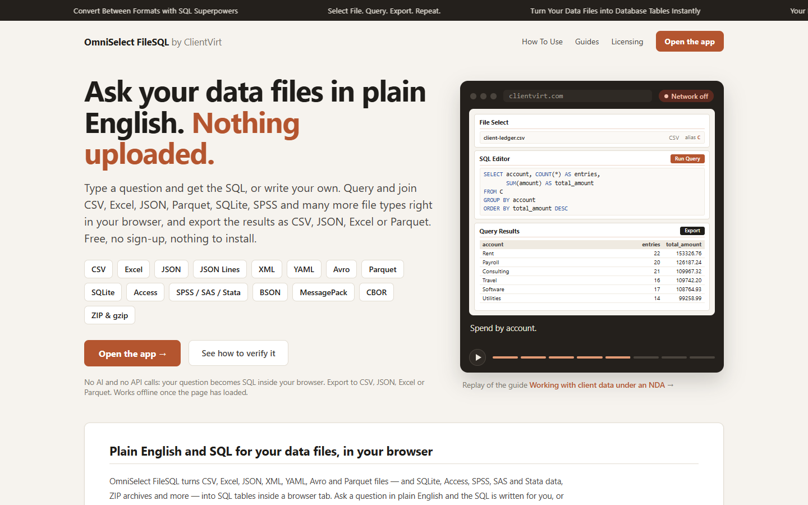
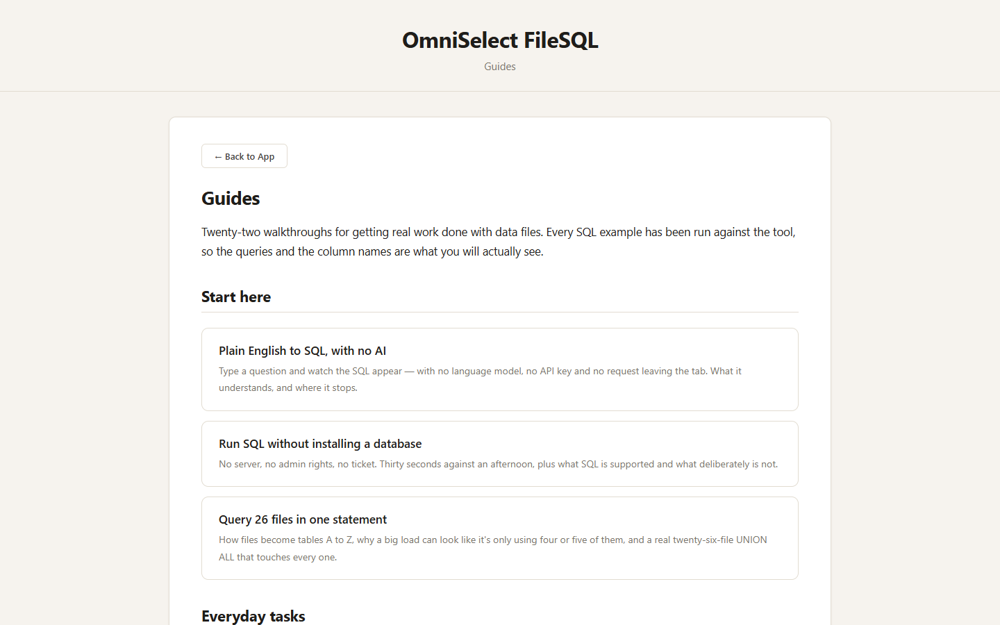
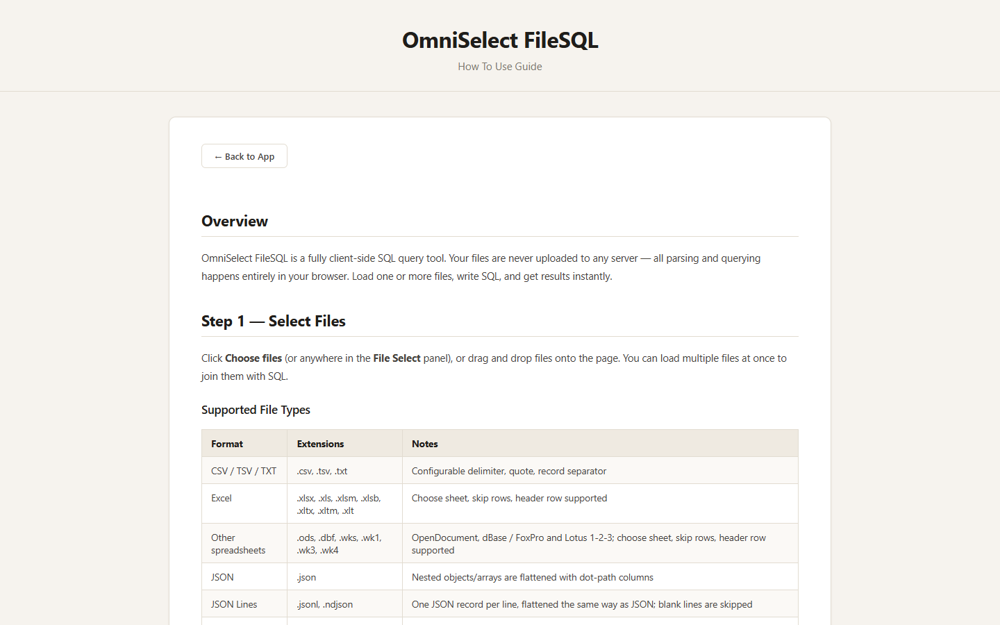
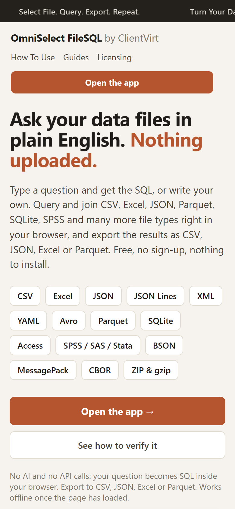

# OmniSelect FileSQL by ClientVirt

**Ask your data files in plain English. Nothing uploaded.**

OmniSelect FileSQL turns CSV, Excel, JSON, XML, YAML, Avro and Parquet files — and SQLite,
Access, SPSS, SAS and Stata data, ZIP archives and more — into SQL tables inside a browser tab.
Ask a question in plain English and the SQL is written for you, or write your own. Filter, join,
group and aggregate, then export the result as CSV, JSON, Excel or Parquet.

Files are read into memory on your own machine: they are not uploaded, there is no account to
create and nothing to install. Free to use, no sign-up.

  <a href="https://www.clientvirt.com/app"><strong>Open the app →</strong></a> &nbsp;·&nbsp;
  <a href="https://www.clientvirt.com">Website</a> &nbsp;·&nbsp;
  <a href="https://www.clientvirt.com/guides/">Guides</a> &nbsp;·&nbsp;
  <a href="https://www.clientvirt.com/how-to-use">How To Use</a> &nbsp;·&nbsp;
  <a href="https://www.youtube.com/@TeeSKayChannel">Videos</a>

> **About this repository:** it holds the README, screenshots, video links and a guide index for
> OmniSelect FileSQL. It contains **no source code**. The software is proprietary to ClientVirt;
> the web version is free to use at [www.clientvirt.com](https://www.clientvirt.com).

## Contents

- [How it works](#how-it-works)
- [Videos](#videos)
- [Guides](#guides)
- [Supported formats](#supported-formats)
- [Check it yourself in 60 seconds](#check-it-yourself-in-60-seconds)
- [Screenshots](#screenshots)
- [Questions](#questions)
- [Licensing and contact](#licensing-and-contact)

## How it works

1. **Add files.** Click the File Select panel or drop files onto it, up to 26 at once. Each file
   becomes a table named by a letter from its filename, so `orders.csv` is `O`.
2. **Ask in plain English.** Type a question such as *total revenue by city*. The SQL appears
   beside it, ready to edit; press Ctrl+Enter to run it. Prefer SQL? Write your own `SELECT`.
   No file to hand? Use **Try sample data** in the File Select panel.
3. **Export.** Download the result as CSV, JSON, Excel or Parquet. The file is generated in your
   browser and saved straight to your disk, and it holds every row of the result, not just the
   rows on screen.

There is no AI service and no API call behind the plain-English box: your question becomes SQL
inside your browser. The SQL engine is DuckDB, running in the tab. The app keeps working offline
once the page has loaded.

## Videos

Eighteen short walkthroughs on the [TeeSKay Channel](https://www.youtube.com/@TeeSKayChannel).
Each one is recorded in the real app, with made-up data.

### Getting started

| Video | What it shows |
|---|---|
|  | **[Analyze a CSV File in 3 Steps, No Setup](https://www.youtube.com/watch?v=5RdzY_RScY0)** Drop a CSV into a browser tab and get from raw rows to real answers in three steps — no install, no server, no upload. |
|  | **[Run SQL Without Installing a Database](https://www.youtube.com/watch?v=ioaJm_fzVYs)** No server, no CREATE TABLE, no admin rights — just a CSV file and a real SQL editor. [Written guide](https://www.clientvirt.com/guides/run-sql-without-installing-a-database) |
|  | **[How Any File Becomes a SQL Table](https://www.youtube.com/watch?v=zQs8z4zugUw)** Three CSV files dropped in at once, each one a table named by a single letter — and immediately joinable, up to twenty-six files at a time. |
|  | **[What Is Client-Side Data Virtualization?](https://www.youtube.com/watch?v=FMrmdF9cvV4)** Querying your files where they already are — in your own browser tab — instead of importing them into a database or pipeline first. |

### Everyday tasks

| Video | What it shows |
|---|---|
|  | **[Join Two CSV Files With SQL (No VLOOKUP)](https://www.youtube.com/watch?v=tgKJpYxn1ec)** A real join instead of a lookup that breaks when a row moves — plus the query that finds every order with no matching customer. |
|  | **[Run SQL on an Excel Spreadsheet, No Formulas](https://www.youtube.com/watch?v=nkOShy3d1-E)** SUMIF becomes a WHERE clause, a pivot table becomes GROUP BY, and several nested formulas become one query. |
|  | **[Clean a Messy CSV Export With SQL, No Excel Macros](https://www.youtube.com/watch?v=DwiOlnwRSqs)** Stray spaces, mixed capitals, duplicate rows and blank phone numbers — fixed in one SQL statement, then exported as a tidy file. |
|  | **[Convert JSON to CSV, Excel or Parquet in a Browser Tab](https://www.youtube.com/watch?v=b5ODaNDSEnI)** One JSON export converted to Excel, Parquet and a filtered CSV — each one a query and an export click. |
|  | **[Window Functions and Nested Joins in Plain English, Typos and All](https://www.youtube.com/watch?v=xgx9nQZ-l6U)** Rank within each group, run a total, take the top 2 per department or join across three files — asked in plain English, even misspelt. [Written guide](https://www.clientvirt.com/guides/window-functions-and-nested-joins) |

### File formats

| Video | What it shows |
|---|---|
|  | **[Open a Parquet File Offline, No Python or Spark](https://www.youtube.com/watch?v=C2PlSDd5C5s)** Load the page, cut the network by hand, then query and export a Parquet file with the connection down the whole time. [Written guide](https://www.clientvirt.com/guides/open-parquet-file-offline) |
|  | **[Query XML, YAML and Avro Files With Plain SQL](https://www.youtube.com/watch?v=sMYCzVLwS1I)** Three formats that normally need three different parsers, loaded together and queried with one ordinary SELECT each. |
|  | **[Open a MongoDB BSON Dump With No MongoDB Installed](https://www.youtube.com/watch?v=Ljr5Po0LkC4)** A mongodump `.bson` file queried with SQL — ObjectIds become text, nested fields become columns. [Written guide](https://www.clientvirt.com/guides/open-bson-file-without-mongodb) |
|  | **[Read MessagePack Files With SQL, No Code](https://www.youtube.com/watch?v=5lGL_894Jfo)** The compact format behind caches, APIs and mobile payloads, queried with plain SQL, 64-bit ids kept exact. [Written guide](https://www.clientvirt.com/guides/read-messagepack-files-with-sql) |
|  | **[Read a CBOR File With SQL, No Library Required](https://www.youtube.com/watch?v=OfpVGr9_H68)** The binary format behind IoT payloads and COSE/CWT tokens, with tagged dates and 64-bit integers intact. [Written guide](https://www.clientvirt.com/guides/read-cbor-files-with-sql) |

### Privacy and offline use

| Video | What it shows |
|---|---|
|  | **[Query a CSV File Without Uploading It — Proof Included](https://www.youtube.com/watch?v=gGr8jEkmSX8)** DevTools open, Network tab visible, a file added and a real query run — and the request list stays empty. [Written guide](https://www.clientvirt.com/guides/verify-nothing-is-uploaded) |
|  | **[Analyze Sensitive Data Without Sending It Anywhere](https://www.youtube.com/watch?v=93BR3RwH8Y4)** The network is cut before the file is added, then the analysis runs entirely in the browser's own memory. |
|  | **[Working With Client Data Under an NDA](https://www.youtube.com/watch?v=pv26kNsjV7M)** A workflow built for the confidentiality clauses an ordinary online tool would breach. [Written guide](https://www.clientvirt.com/guides/work-with-client-data-under-nda) |
|  | **[Using SQL Offline, Even on an Air-Gapped Machine](https://www.youtube.com/watch?v=ijDNpvlRPVM)** Load the page once, cut the network, and keep querying, exporting and joining files with no connection. [Written guide](https://www.clientvirt.com/guides/use-sql-offline-air-gapped) |

## Guides

Twenty-two walkthroughs on [clientvirt.com/guides](https://www.clientvirt.com/guides/). Every SQL
example has been run against the tool, so the queries and column names are what you will see.
▶ marks a guide that has a video.

### Start here

- [Plain English to SQL, with no AI](https://www.clientvirt.com/guides/plain-english-to-sql) — type a question and watch the SQL appear, with no language model, no API key and no request leaving the tab. What it understands, and where it stops.
- [Run SQL without installing a database](https://www.clientvirt.com/guides/run-sql-without-installing-a-database) [▶](https://www.youtube.com/watch?v=ioaJm_fzVYs) — no server, no admin rights, no ticket, plus what SQL is supported and what deliberately is not.
- [Query 26 files in one statement](https://www.clientvirt.com/guides/query-26-files-at-once) — how files become tables A to Z, and a real twenty-six-file `UNION ALL` that touches every one.

### Everyday tasks

- [Join two Excel workbooks without VLOOKUP](https://www.clientvirt.com/guides/join-two-excel-files) — a real join, asked in plain English, plus the four reasons a join returns zero rows.
- [Window functions and nested joins, in plain English](https://www.clientvirt.com/guides/window-functions-and-nested-joins) [▶](https://www.youtube.com/watch?v=xgx9nQZ-l6U) — RANK, running totals, LAG/LEAD and QUALIFY, and joins across three files, all from a sentence.
- [One query across seven file formats](https://www.clientvirt.com/guides/query-seven-formats-at-once) — CSV, Excel, JSON, XML, YAML, Avro and Parquet loaded together and joined in one `SELECT`.
- [Open a Parquet file offline](https://www.clientvirt.com/guides/open-parquet-file-offline) [▶](https://www.youtube.com/watch?v=C2PlSDd5C5s) — read and query a `.parquet` file without Python, Spark or DuckDB, and convert it to CSV or Excel.
- [Open a .csv.gz file without extracting it](https://www.clientvirt.com/guides/open-csv-gz-file-without-extracting) — query a gzipped CSV, JSON or XML export straight away, with no uncompressed copy left on disk.

### Opening specialist formats

- [No SAS licence? Open a .sas7bdat file and turn it into CSV](https://www.clientvirt.com/guides/read-sas7bdat-without-sas) — dates arrive as dates, missing values stay missing.
- [Inside an FDA submission: reading SAS transport (.xpt) files](https://www.clientvirt.com/guides/read-xpt-sas-transport-file) — SDTM and ADaM domains, AE joined to DM on USUBJID, adverse events counted by arm.
- [Survey data stuck in a .sav file? Read it without SPSS](https://www.clientvirt.com/guides/open-sav-file-without-spss) — value labels, user-missing answers, frequencies, crosstabs and weighted means.
- [From a Stata .dta file to Excel, value labels and all](https://www.clientvirt.com/guides/dta-file-to-excel-without-stata) — codes and their labels side by side, `%td` dates as dates.
- [Getting the tables out of an .accdb or .mdb, without Access](https://www.clientvirt.com/guides/open-access-database-without-access) — on a Mac, a Chromebook or any PC, plus a crib sheet from Access SQL to standard SQL.
- [Exploring a SQLite database in a browser tab](https://www.clientvirt.com/guides/explore-sqlite-database-in-browser) — tables and views, joins within one database, and the `-wal` file that can hide recent changes.
- [Read Avro and Feather files without writing a line of Python](https://www.clientvirt.com/guides/read-avro-and-feather-files) — nested Avro records flattened, and LZ4- and ZSTD-compressed Feather files read as they are.
- [Open a MongoDB .bson dump without MongoDB installed](https://www.clientvirt.com/guides/open-bson-file-without-mongodb) [▶](https://www.youtube.com/watch?v=Ljr5Po0LkC4) — ObjectIds become text, nested documents flatten into columns.
- [Read MessagePack files with SQL, no code](https://www.clientvirt.com/guides/read-messagepack-files-with-sql) [▶](https://www.youtube.com/watch?v=5lGL_894Jfo) — opened straight into a table, with a 64-bit id kept exact instead of rounded.
- [Read CBOR files with SQL, no library](https://www.clientvirt.com/guides/read-cbor-files-with-sql) [▶](https://www.youtube.com/watch?v=OfpVGr9_H68) — tagged dates and big integers decoded correctly, a CBOR sequence read the same as an array.

### Privacy and proof

- [How to verify nothing is uploaded](https://www.clientvirt.com/guides/verify-nothing-is-uploaded) [▶](https://www.youtube.com/watch?v=gGr8jEkmSX8) — three independent checks: the network panel, the content security policy, and disconnecting entirely.
- [Working with client data under an NDA](https://www.clientvirt.com/guides/work-with-client-data-under-nda) [▶](https://www.youtube.com/watch?v=pv26kNsjV7M) — for consultants and auditors: a workflow you can defend, and wording you can give the client.

### Working offline

- [Run SQL with the network disconnected](https://www.clientvirt.com/guides/run-sql-with-the-network-off) — load the page, pull the cable, and keep querying and exporting.
- [Offline and air-gapped machines](https://www.clientvirt.com/guides/use-sql-offline-air-gapped) [▶](https://www.youtube.com/watch?v=ijDNpvlRPVM) — what works with no connection, the one thing that needs one, and how to get a build you host yourself.

The complete reference — file options, SQL syntax, joins and exports — is
[How To Use](https://www.clientvirt.com/how-to-use).

## Supported formats

| Format | Extensions | How it becomes a table |
|---|---|---|
| CSV, TSV, text | `.csv` `.tsv` `.txt` | Choose the delimiter, quote character and line ending; skip rows; header row optional |
| Excel | `.xlsx` `.xls` `.xlsm` `.xlsb` `.xltx` `.xlt` | Pick the sheet; skip rows; header row optional |
| Other spreadsheets | `.ods` `.dbf` `.wk1` `.wk3` | OpenDocument, dBase / FoxPro and Lotus 1-2-3, read like Excel |
| JSON | `.json` | Nested objects become columns named by their path; arrays of objects become rows |
| JSON Lines | `.jsonl` `.ndjson` | One record per line, flattened the same way as JSON |
| XML | `.xml` | Nested elements and attributes become columns |
| YAML | `.yaml` `.yml` | Nested structures flattened the same way as JSON |
| Avro | `.avro` | Uncompressed, deflate and snappy files |
| Parquet | `.parquet` | Nested columns included |
| Arrow / Feather | `.arrow` `.feather` | Arrow IPC files and streams, uncompressed or LZ4 / ZSTD |
| SQLite | `.sqlite` `.db` `.gpkg` | Pick the table or view; GeoPackage files included |
| Microsoft Access | `.accdb` `.mdb` | Every table; files without a password |
| SPSS, SAS, Stata | `.sav` `.zsav` `.por` `.sas7bdat` `.xpt` `.dta` | Dates become dates; labelled values get a `_label` column beside the code |
| BSON, MessagePack, CBOR | `.bson` `.msgpack` `.cbor` | MongoDB dumps and binary records, flattened the same way as JSON |
| Gzipped | `.csv.gz` `.json.gz` `.xml.gz` … | Any format above, unpacked in your browser and read as the file inside |
| ZIP and TAR archives | `.zip` `.tar` `.tar.gz` `.tgz` | Every readable file inside becomes its own table |

Each file can be up to 50 MB and 1,000,000 rows.

## Check it yourself in 60 seconds

You do not have to take "nothing is uploaded" on trust. Your browser can show you.

1. [Open the app](https://www.clientvirt.com/app) and let it finish loading, press F12 and open the **Network** tab.
2. Clear the list.
3. Add a file and run a query. The list stays empty: the file was read and queried without a single request.
4. For the stronger test, turn off your Wi-Fi and do it again. Queries and exports still work.

Before you clear the list you will see the page loading its own files — the scripts, the code
editor and the query engines — all from clientvirt.com and nothing from anywhere else. The
[verification guide](https://www.clientvirt.com/guides/verify-nothing-is-uploaded) covers this and
two further checks.

## Screenshots

**Home page.** The hero replays the video *Working With Client Data Under an NDA*: the network is
switched off, a made-up client ledger is added, and spend by account is queried.

**The app.** Two sample files loaded as tables `O` and `C`, a plain-English question, the SQL it
became, and the results.

**Guides** and the **How To Use** reference.

| Guides | How To Use |
|---|---|
|  |  |

**On a phone.**

## Questions

**Is it free?** Yes. The web version is free to use and needs no sign-up. Organisations that need
an internal deployment, a written licence or a security review pack can
[get in touch](https://www.clientvirt.com/contact).

**Is my data stored anywhere?** No. Files are held in memory for as long as the tab is open and
discarded when you close it. The tool writes nothing to local storage and sets no cookies.

**Do I need to know SQL?** No. Ask in plain English and the SQL is written for you, inside your
browser, with no AI service and no API calls. You can read and edit it before it runs.

**What SQL can I use?** The engine is DuckDB, running inside your browser tab: `SELECT` with
`WHERE`, inner and left `JOIN`, `GROUP BY`, `HAVING`, `ORDER BY` and `LIMIT`, aggregates such as
`COUNT`, `SUM` and `AVG`, string functions such as `UPPER` and `TRIM`, and `CASE` and `COALESCE` and more.

**Does it work offline?** Yes, once the page has loaded: you can disconnect and keep adding files,
running queries and exporting. Reloading the page needs the connection again.

**Can we run it on our own intranet?** Yes. It is a static, self-contained build with no server
component of its own and no third-party network calls, so it suits intranet or air-gapped
hosting. A build for this is available on request.

## Licensing and contact

- Web app: free at [www.clientvirt.com/app](https://www.clientvirt.com/app)
- Internal deployments, written licences and security review packs: [clientvirt.com/contact](https://www.clientvirt.com/contact)
- [Privacy Policy](https://www.clientvirt.com/privacy)
- [Terms of Use](https://www.clientvirt.com/terms)

This repository contains documentation, screenshots and links only — see [LICENSE](LICENSE).
© 2026 ClientVirt. All rights reserved.
